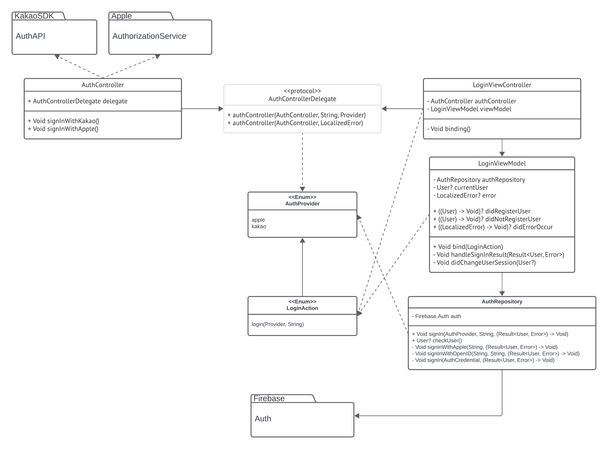

#  나다운

### 목차
#### 1. [팀원](#📚-개요-및-설명)
#### 2. [순서도](#🧩-순서도)
#### 3. [주요 화면](#📱-주요-화면) 
#### 4. [개발 사항](#⚙️-개발-사항) 
#### 5. [트러블 슈팅](#🛠️-트러블-슈팅) 
#### 6. [회고](#🤔-회고) 

## 📚 개요 및 프로젝트 구성
### 사용 라이브러리

|구분|사용 기술|
|--|--|
|UI|UIKit, Lottie|
|비동기 프로그래밍|Closure|
|아키텍처|MVVM|
|근거리 무선 통신|NearbyInteraction, MultiPeer|

### 팀원
|미니|
| :--------: |
|     |      |
| <a href="https://github.com/leegyoungmin"> 
*@Minii*
</a>|

## 🧩 순서도
##### 잘 안보이시는 경우, 이미지를 클릭해보세요.

#### Login

## 📱 주요 화면

## ⚙️ 개발 사항
### 📌  1

### 📌 2

## 🛠️ 트러블 슈팅
### 📌 UIAction쓰니까 ViewController가 메모리에서 해제되지 않는 문제
로그인을 성공하면 WindowScene의 RootViewController를 변경하는 로직을 작성했습니다. 화면이 교체된 후에는 로그인 화면 객체가 제거되지 않고 메모리를 가지고 있는 문제가 발생했습니다.

문제를 해결하기 위해서 Instrument을 활용하여서 메모리 구조를 봤습니다. ViewModel의 바인딩 메서드가 문제라고 추측했습니다. 하지만, 예상한 것과 다르게 RC의 값이 바인딩 메서드의 개수보다 적게나왔습니다. (바인딩 메서드 3개, RC 2개) 참조가 발생할 수 있는 곳을 살펴봤고, UIButton의 액션을 추가하기 위해서 사용했던 UIAction의 CompletionHandler 내부에서 self를 강하게 참조하고 있기에 발생했습니다.

MemoryLeak이 심각한 경우 외부 단편화 (Fragmentation)이 발생할 수 있습니다. 외부 단편화는 실제 사용하지 않는 객체가 메모리가 존재하게 되면서 메모리 공간이 충분하지 않게 되는 것입니다. 이는 예기치 못한 앱의 종료를 야기할 수 있기 때문에 개발을 하면서 조심해야 합니다.

## 🤔 회고
### 📌
