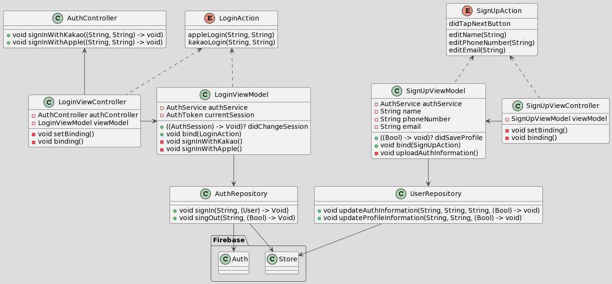

#  나다운
## 🧮 프로젝트 소개
- 나다운 명함을 제공하는 앱
- 명함도 똑똑하게 제공할 수 있는 앱

## 📍 목차
#### 1. [팀원](#🧑🏻‍💻-1-팀원)
#### 2. [순서도](#🔖-2-순서도)
#### 3. [타임라인](#⏱-3-타임라인)
#### 4. [병합 내용](#💻-4-병합-내용)
#### 5. [TDD](#🎯-5-TDD(테스트-코드-작성-과정))
#### 6. [회고](#📝-6-회고)

## 🧑🏻‍💻 1. 팀원

|미니|
| :--------: |
|     |      |
| <a href="https://github.com/leegyoungmin"> 
*@Minii*
</a>|

## 🔖 2. 순서도
### Class Diagram
#### Auth

## ⏱ 3. 타임라인

## 💻 4. 기능 개발
### 📌  1

### 📌 2

## 🎯 5. 트러블 슈팅
### 📌 

## 📝 6. 회고 
### 📌
